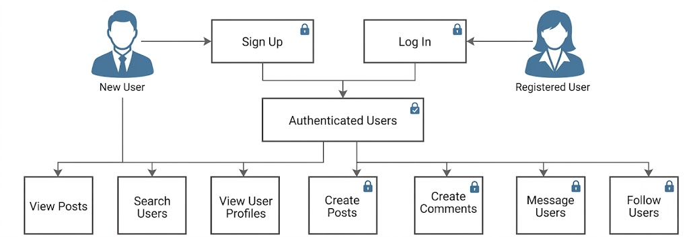
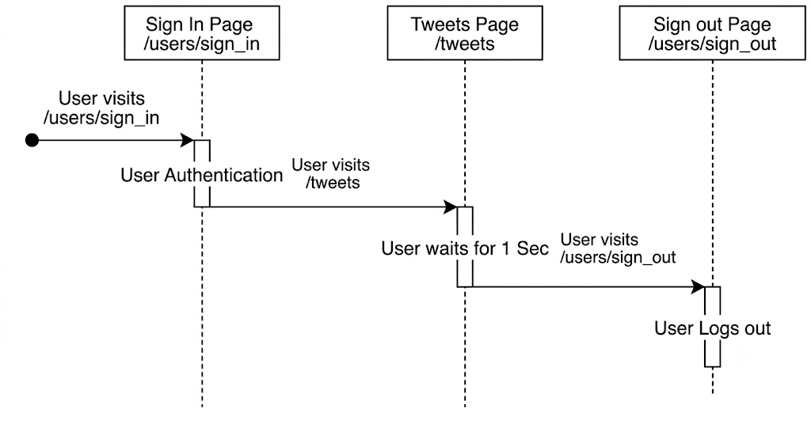

## Project Overview 

When engineering large-scale internet applications, high-concurrency traffic conditions inevitably expose hidden hardware and database limitations. This project introduces a containerized, distributed testbed modeled after a microblogging platform. It was engineered specifically to run high-throughput stress tests, monitor real-time system degradation, and systematically analyze infrastructure bottlenecks. Rather than focusing on frontend complexity, the application leverages a lightweight server layout to keep the computational focus entirely on optimizing backend database routing, horizontal scaling strategies, and memory performance under heavy concurrent workloads. 

You may view the source code at the [GitHub repository (archived)](https://github.com/scalableinternetservicesarchive/Tweeters) or my [fork](https://github.com/satyam-aw/Tweeters). 

## Experimental State Machine & Workflows 

To accurately simulate complex production traffic, the testbed maps real-world user paths into structured, concurrent state machines. This design allows the framework to inject diverse reading and writing behaviors simultaneously, exposing lock contentions and query execution delays. 

  
   
  <em>Figure 1: Global state transition paths utilized during distributed load testing.</em>

--- 

### Case Study: Homepage Traversal State Trajectory 

To evaluate how backend architectures degrade under high-velocity traffic, we configured a dedicated user journey modeled as a deterministic sequence diagram. This trajectory isolates read-heavy data paths to stress database thread handling. 

  
   
  <em>Figure 2: Sequence diagram mapping programmatic state transitions during the Homepage Traversal workflow.</em>

During this specific test trajectory, the automated framework forces active sessions through three sequential stages: 

1. **Authentication State (`/users/sign_in`)**: Initiates user session creation and handles database lookup queries to verify credentials. 
2. **Resource Consumption State (`/tweets`)**: Queries the global content feed, fetching relational records. The simulation enforces a deterministic **one-second think time delay** to mimic realistic user consumption, holding database resources open to intentionally test lock limits. 
3. **Session Termination State (`/users/sign_out`)**: Safely tears down the session token and frees allocated thread connections back to the EC2 server pool. 

--- 

Please refer to the complete [project report](https://docs.google.com/document/d/1oxVZuh_Wj5Tc_Jv-8qsjNRmkKm0Kov0G5AQeYhBpz3M/edit?usp=sharing) to inspect our comprehensive data logs and infrastructure charts. Below are the benchmark results showing the direct throughput improvements achieved specifically after deploying our database query pagination rules under peak concurrent loads.
